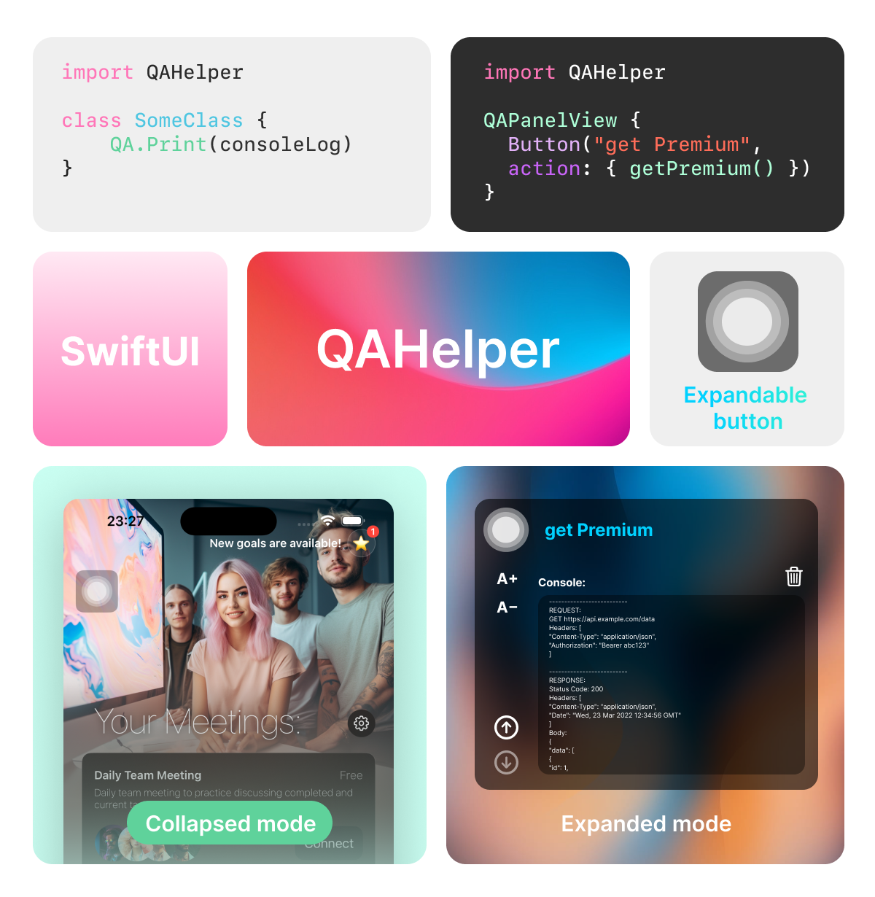

# QAHelper
A powerful tool for manual application testing.


## Features
QAHelper introduces an additional button into your application that triggers an extended mode for testers. This mode includes:

- **Console Log:** Testers can view the application logs in real-time, facilitating debugging and issue identification.

- **Additional Buttons:** In the extended mode, additional buttons are available to enable various features such as premium mode. This allows testers to check different states of the application without having to manually change settings or data.

## Usage

To use QAHelper, simply place the QA.Print console output function in your code in all the places that interest you.
```swift
import QAHelper

class SomeClass {
    func fetchData() -> ResultData {
        do {
        let result = try NetworkManager(.getData)
          QA.Print("✅ Fetching data result:")
          QA.Print(result.stringValue)
        } catch {
          QA.Print("🤡 Fetching data error")
          QA.Print(error.localizedError)
        }
    }
}
```

After that, place the QAHelper module where you want to display it on the screen. If necessary, you can add various controls inside QAHelper. In this example, we will add a button that enables Premium mode in the application.
```swift
import QAHelper
import SwiftUI

struct SomeView: View {
    var body: some View {
        ZStack {
            Text("Welcome to SomeView")
            QAPanelView {
                Button("enable Premium", action: {
                    isPremium.toggle()
                  })
              }
          }
      }
  }
```

## License

QAHelper is distributed under the MIT license. See `LICENSE` for more information.

## Contact

If you have any questions or suggestions for improving QAHelper, please feel free to reach out.
stepanokdev@gmail.com
---

With QAHelper, mobile application testing becomes easier and more efficient!
